# backend-tcc

Aplicação para geração de DER e exportação de projeto

## Pré Instalação

OPCIONAL:
[Baixe o Visual Studio Code](https://code.visualstudio.com/download) para importação do projeto.

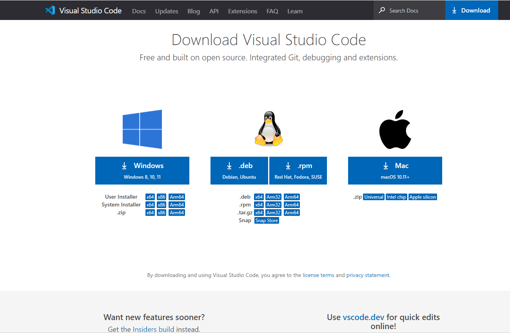

_Obs: como não há a obrigatoriedade de uma IDE para subir a aplicação, a instalação do VSCode é apenas para facilitar manutenção no desenvolvimento do software_

OBRIGATÓRIO:

[Instalar Node e NPM no site oficial](https://nodejs.org/en/download/)

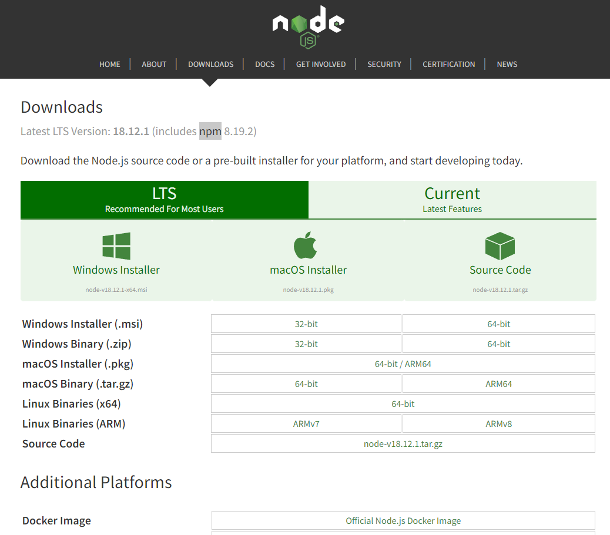

## Instalação

Clone este repositório e abra-o através do VSCode para manutenção do projeto.

Abra um terminal na pasta em que o projeto foi clonado e execute os comandos `npm install` e `npm start` (para este passo é obrigatório a instalação do node e NPM).

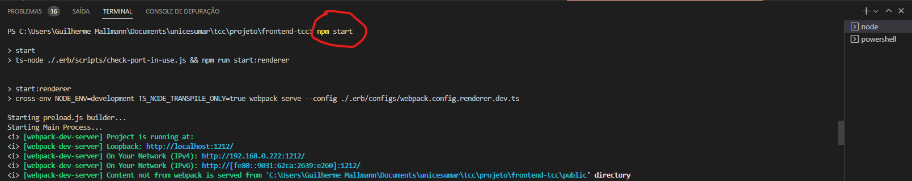

## Utilização

A aplicação está configurada para rodar na porta 1212, sendo assim, a aplicação irá subir na sua máquina na porta 1212.

Visto que estamos desenvolvendo uma aplicação desktop, será aberta a aplicação diretamente na sua máquina.

Também, podemos gerar o executável da aplicação através do comando `npm run package` o que irá gerar o seguinte output:

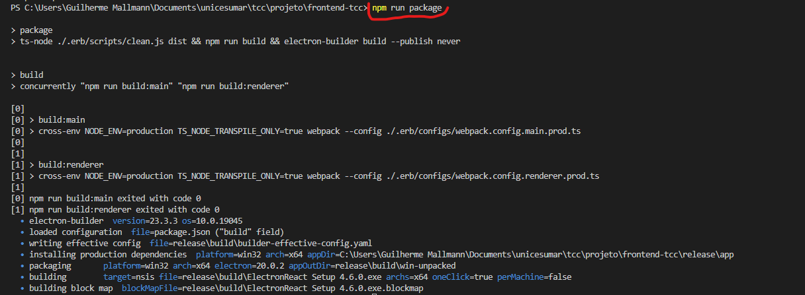

**O executável final do projeto ficará dentro da pasta `release/build/ElectronReact Setup 4.6.0.exe`**

## Funcionalidades

A aplicação já vem com duas entidades de exemplo cadastradas em seu código por uma questão de UX e o usuário não estar perdido no que pode ser feito dentro da plataforma:

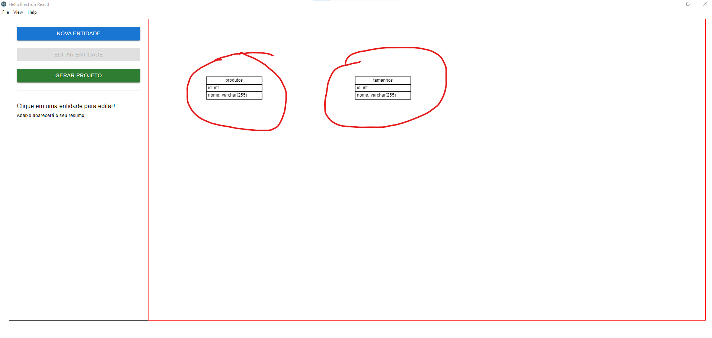

### Criar Entidade

Ao clicar em Nova entidade, nós podemos gerar uma nova tabela dentro do sistema, podendo definir nome e colunas:

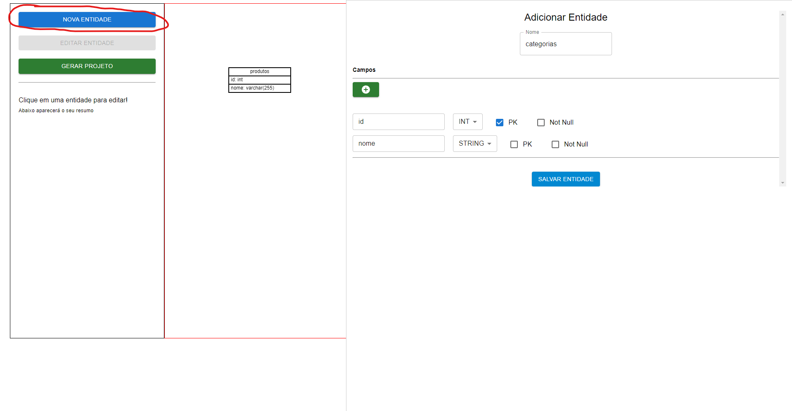

Basta escrever o nome da entidade e a cada novo campo que quisermos colocar na entidade, basta clicar no botão verde "+".

Após definirmos a entidade, podemos simplesmente clicar em "Salvar Entidade" e ela automaticamente vai aparecer no canva:

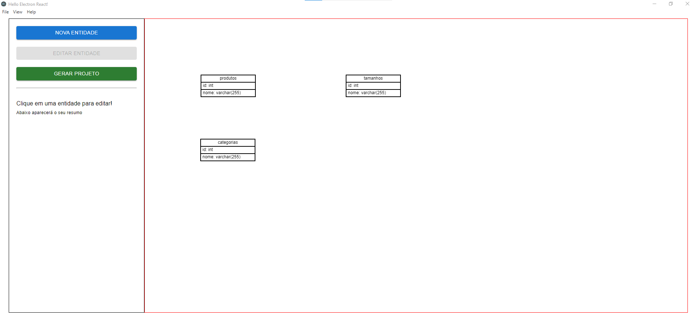

_As relações entre as entidades não podem ser definidas no momento de criação, mas sim no momento de edição._

### Editar Entidade

Para editar uma entidade, precisamos clicar em alguma que está no canva. Ao clicarmos em alguma entidade no canva, o botão "Editar Entidade" ficará habilitado e veremos logo abaixo um resumo sobre ela:

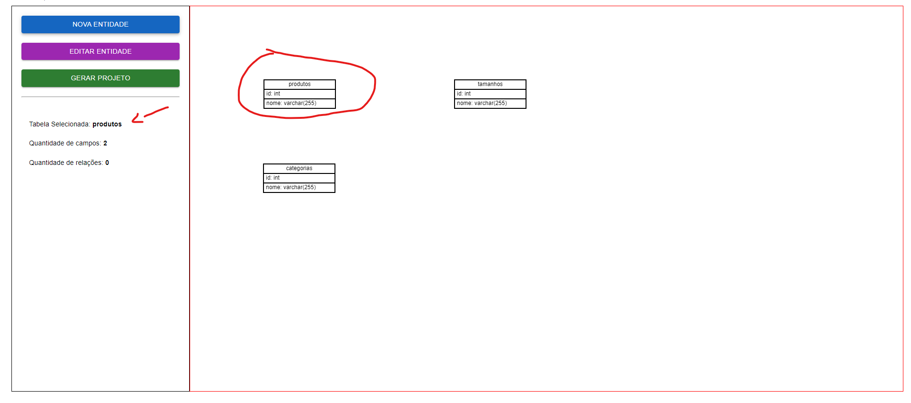

Ao clicarmos em editar entidade, podemos editar os campos já existentes, assim como gerar as relações entre as entidades:

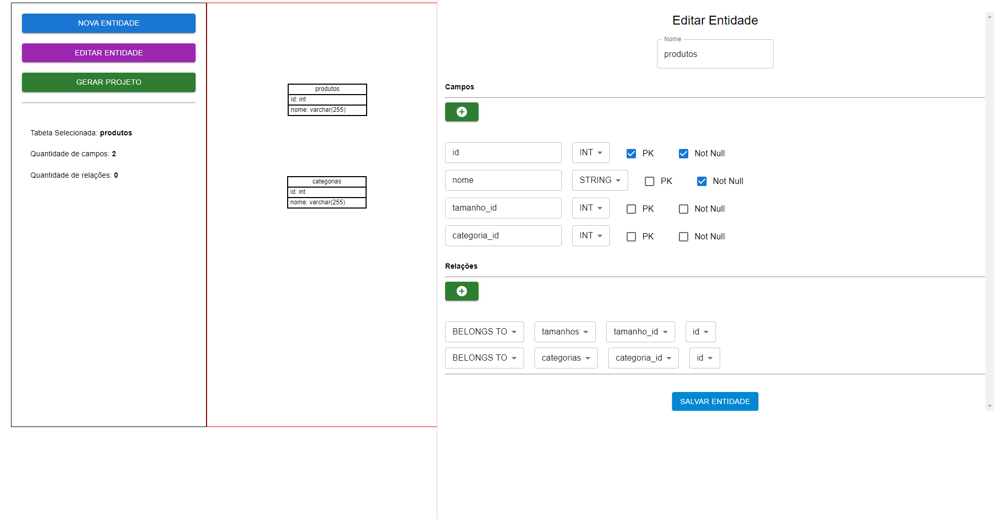

Após gerarmos as relações entre as entidades, automaticamente elas aparecerão no canva com as linhas de ligações entre as tabelas:

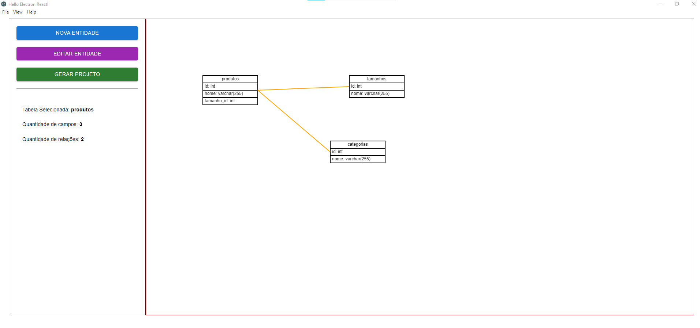

### Gerar Projeto

Para gerar os CRUDs dessas entidades, basta clicar em "Gerar Projeto".

Com isso, uma tela de confirmação deve aparecer:

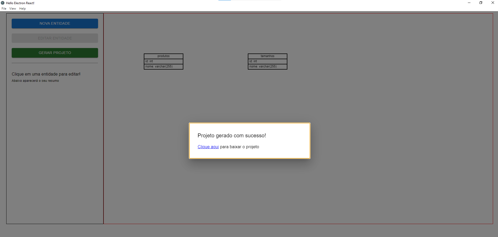

Para subir a API gerada, confira o README do repositório do backend deste projeto.
